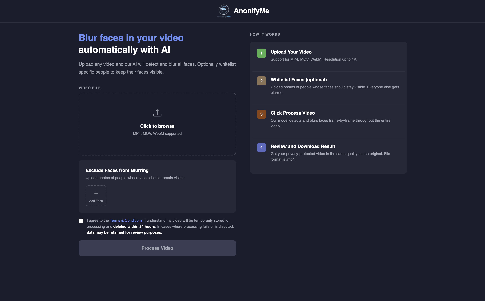
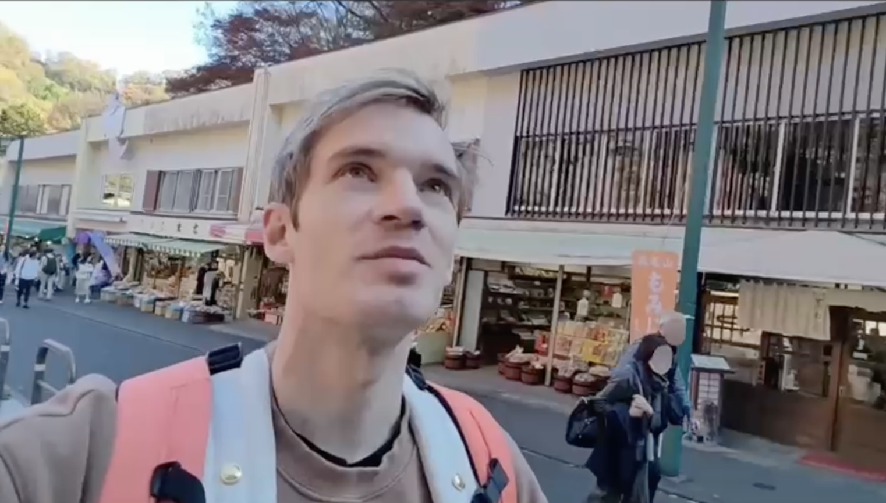

# AnonifyMe

**A privacy-first video anonymisation platform that blurs faces automatically while keeping the ones you choose visible.**

AnonifyMe lets users upload a video and optionally provide reference photos of identities to preserve. A Django backend fetches the video from Azure Blob Storage, runs InsightFace's buffalo_l ONNX model for detection, tracks faces across frames with DeepSORT, and matches against a FaceNet embedding whitelist before applying Gaussian blur to every non-whitelisted face. Low-confidence detections are automatically captured as training failure cases and fed into a monthly SCRFD retraining pipeline orchestrated on ClearML.

## Key Features

- **Video face blurring** — frame-by-frame Gaussian blur with elliptical mask blending for smooth edges
- **Selective whitelisting** — upload reference photos for identities to preserve
- **Multi-frame tracking** — DeepSORT tracker maintains face identity across frames, preventing flicker on fast-moving subjects
- **Continuous self-improvement** — low-confidence detections (0.3–0.7 conf) are saved to Azure and fed into a monthly retraining run without manual annotation
- **MLOps pipeline** — ClearML-orchestrated SCRFD retraining with Optuna hyperparameter search, mAP gating, and versioned ONNX model upload
- **Cloud-native storage** — all uploads, outputs, and model artifacts live in Azure Blob
- **CI/CD automation** — GitHub Actions runs Django health checks, retraining smoke tests, and a scheduled monthly pipeline trigger on the 1st of every month

---

## Sample

**Homepage** — upload a video, attach whitelist reference photos, track processing progress in real time, and download processed video.



**Blurred output** — all non-whitelisted faces are anonymised with a smooth Gaussian blur.



---

## System Architecture

```
┌───────────────────────────────┐
│  Browser                      │
│  ├─ Upload video              │
│  ├─ Upload whitelist photos   │
│  └─ Download processed video  │
└───────────┬───────────────────┘
            │  HTTP / REST
            ▼
┌───────────────────────────────────────────────────────────────┐
│  Django REST API (Python 3.12)                                │
│  ├─ VideoStorageService   → Azure Blob (upload / download)    │
│  ├─ FaceDetector          → InsightFace buffalo_l (ONNX)      │
│  │                           + DeepSORT multi-frame tracking  │
│  ├─ FaceRecognizer        → DeepFace FaceNet embeddings       │
│  └─ VideoProcessingService → FFmpeg frame extraction + encode │
└──────────────────────┬────────────────────────────────────────┘
                       │
          ┌────────────▼────────────────────────────────────┐
          │  Azure Blob Storage                              │
          │  ├─ uploads/{id}/original.mp4                   │
          │  ├─ uploads/{id}/whitelist/{name}.jpg           │
          │  ├─ outputs/{id}/processed.mp4                  │
          │  ├─ training/failure_cases/{id}/                │
          │  │    ├─ *.jpg  (low-confidence crops)          │
          │  │    └─ annotations.jsonl                      │
          │  └─ models/scrfd/                               │
          │       ├─ pretrained/scrfd_10g.pth               │
          │       └─ candidate/scrfd_retrained.onnx         │
          └────────────┬────────────────────────────────────┘
                       │
          ┌────────────▼──────────────────────────────────────────────┐
          │  ClearML Retraining Pipeline (Python 3.9, SageMaker)      │
          │                                                            │
          │  fetch_training_data                                       │
          │       │                                                    │
          │  prepare_dataset  ──── merge WiderFace + failure cases     │
          │       │                90/10 train/val by source video å    │
          │       │                                                    │
          │  hpo_search  ──────── Optuna: LR, weight decay, warmup     │
          │                                                            │
          │       │                                                    │
          │  train_scrfd  ─────── warm-start from SCRFD-10G            │
          │       │                best HPs, combined dataset          │
          │       │                                                    │
          │  evaluate_and_tag  ── export ONNX, compare mAP@0.5         │
          │       │                tag winner as 'candidate'           │
          │       │                                                    │
          │  upload_model  ────── push ONNX + checkpoint to Azure      │
          └───────────────────────────────────────────────────────────┘
```

---

## ML / AI Components

### Face Detection

**Model:** InsightFace `buffalo_l` (ONNX runtime): a SCRFD-based detector pre-trained on WiderFace. 

**Tracking:** DeepSORT maintains a track ID per face across frames. 

**Failure case capture:** Detections in the 0.3–0.7 confidence band are cropped and saved alongside their bounding box annotations as JSONL. A human reviewer prunes non-faces before the next retraining run.

### Face Recognition (Whitelisting)

For every tracked face in each frame, a FaceNet embedding is extracted and compared against all enrolled embeddings using cosine similarity. If the maximum similarity exceeds 0.55 the face is whitelisted and no blur is applied. The threshold was chosen empirically to balance false-positive (accidental preservation) and false-negative (accidental blurring) rates.

### Blur

Non-whitelisted faces are blurred with a 99×99 Gaussian kernel (σ=30) applied through an elliptical mask. The mask is feathered at the edges by blending the blurred and original frames, producing a smooth boundary rather than a hard rectangular crop.

---

## MLOps Pipeline

The retraining pipeline runs on ClearML-managed agents (targeting SageMaker GPU instances) and is triggered either manually or automatically on the 1st of every month via GitHub Actions.

### Pipeline Steps

```
fetch_training_data
     │  download failure cases + pretrained SCRFD-10G from Azure
     │
prepare_dataset
     │  merge failure cases with WiderFace (SCRFD labelv2 format)
     │  split failure cases 90/10 train/val by source video
     │  (source-video split prevents person identity leakage across sets)
     │
hpo_search  ──── Optuna TPE sampler
     │            search space: LR, weight decay, warmup iters
     │
train_scrfd
     │  warm-start from SCRFD-10G checkpoint
     │  combined dataset: WiderFace + curated failure cases
     │  output: PyTorch checkpoint + ONNX model
     │
evaluate_and_tag
     │  compute mAP@0.5 on held-out val set
     │  compare against production baseline
     │  tag as 'candidate' only if mAP improves
     │
upload_model
     push ONNX + checkpoint to Azure
```

### Data Strategy

- **WiderFace** — fixed base dataset, provides breadth of face diversity
- **Failure cases** — low-confidence detections from real user videos, split by source video to prevent the same person appearing in both train and val
- **Expanding window** — every qualifying failure case since system launch is included in each retrain; the monthly trigger ensures even quiet months still refresh the model
- **Human-in-the-loop** — reviewers prune the failure case bucket before each run; non-face crops from background objects are discarded

### Experiment Tracking (ClearML)

Every video processing run logs to **`anonifyme-video-processing`**:
- `avg_detection_confidence`, `total_faces_detected`, `failure_cases_captured`
- Video metadata: fps, resolution, duration, whitelist identity count

Every retraining run logs to **`anonifyme-scrfd-retrain`**:
- Training loss curves per epoch
- Optuna trial scores and best hyperparameter set
- mAP@0.5 on WiderFace val, failure-case val, and combined val
- ONNX model artifact + checkpoint as tracked outputs

---

## Tech Stack

| Layer | Technology |
|---|---|
| Web framework | Python 3.12, Django 6.0 |
| Database | PostgreSQL (production), SQLite (local) |
| Cloud storage | Azure Blob Storage |
| Face detection | InsightFace buffalo_l (ONNX Runtime) |
| Face tracking | DeepSORT |
| Face recognition | DeepFace (FaceNet backend) |
| Video processing | OpenCV |
| HPO | Optuna 4.6 |
| ML framework | PyTorch |
| MLOps | ClearML |

---

## Project Structure

```
anonifyme/
├── config/
│   ├── settings.py              # Django settings — Azure, ClearML, DB, storage
│   ├── urls.py                  # Root URL routing
│   └── wsgi.py / asgi.py
│
├── face_blur/                   # Core Django app
│   ├── models.py                # FileMetadata — tracks upload/processing status
│   ├── views.py                 # Upload, whitelist, download, status endpoints
│   ├── urls.py
│   ├── services/
│   │   ├── video_processing.py  # End-to-end pipeline: fetch → detect → blur → upload
│   │   ├── face_detection.py    # InsightFace + DeepSORT detection class
│   │   ├── face_recognition.py  # FaceNet embedding enrollment and matching
│   │   └── video_storage.py     # Azure Blob abstraction (upload, download, SAS URLs)
│   ├── templates/
│   │   ├── homepage.html        # Main UI: upload, whitelist, download
│   │   ├── sample.html
│   │   └── terms.html
│   └── static/
│       ├── css/
│       ├── js/
│       └── images/
│
├── retraining/                  # SCRFD retraining pipeline (Python 3.9)
│   ├── pipeline.py              # ClearML multi-step pipeline definition
│   ├── __init__.py              # CLI entrypoint + dependency checks
│   ├── __main__.py              # python -m retraining entry
│   ├── debug_eval.py            # Standalone evaluation utilities
│   └── requirements.txt        # Legacy MMDetection stack
│
├── scripts/
│   └── trigger_retraining.py   # GitHub Actions: enqueues pipeline to ClearML
│
├── .github/workflows/
│   └── ci.yaml                 # 3 jobs: Django check, retrain smoke, monthly trigger
│
├── models/
│   └── buffalo_l/              # InsightFace detection model weights
│
├── requirements.txt            # App dependencies (Python 3.12)
├── railpack.toml               # Railway deployment config
└── .env.example                # Environment variable template
```

---

## Local Setup

### Web App (Python 3.12)

```bash
conda create -y -n anonifyme-app python=3.12
conda activate anonifyme-app
pip install -r requirements.txt
```

Copy `.env.example` to `.env` and fill in Azure Blob, PostgreSQL, and ClearML credentials, then:

```bash
python manage.py migrate
python manage.py runserver
```

Open `http://127.0.0.1:8000`.

### SCRFD Retraining (Python 3.9)

The retraining stack requires PyTorch 1.10 and the legacy OpenMMLab build chain, so it runs in a separate environment:

```bash
conda create -y -n anonifyme-retraining python=3.9
conda activate anonifyme-retraining

pip install --upgrade pip "setuptools<70" wheel "cython==0.29.33"
conda install -y "mkl<2024" numpy=1.23.5
conda install -y -c pytorch pytorch==1.10.2 torchvision==0.11.3 cudatoolkit=11.3

pip install mmcv-full==1.3.18 \
  -f https://download.openmmlab.com/mmcv/dist/cu113/torch1.10.0/index.html

pip install --no-build-isolation -r retraining/requirements.txt
```

Before running, ensure:
- WiderFace images and SCRFD labelv2 annotations are present at `retraining/dataset/`
- Pretrained SCRFD-10G checkpoint is uploaded to Azure at `models/scrfd/pretrained/scrfd_10g.pth`
- ClearML credentials are set in `.env`

```bash
python -m retraining
```

### Environment Variables

| Variable | Description |
|---|---|
| `AZURE_STORAGE_ACCOUNT_NAME` | Azure Blob Storage account name |
| `AZURE_STORAGE_CONTAINER_NAME` | Blob container for uploads and outputs |
| `AZURE_CLIENT_ID` | Azure service principal client ID |
| `AZURE_CLIENT_SECRET` | Azure service principal secret |
| `AZURE_TENANT_ID` | Azure AD tenant ID |
| `DATABASE_URL` | PostgreSQL connection string |
| `CLEARML_API_HOST` | ClearML server API URL |
| `CLEARML_ACCESS_KEY` | ClearML access key |
| `CLEARML_SECRET_KEY` | ClearML secret key |

---

## API Reference

| Method | Path | Description |
|---|---|---|
| `GET` | `/` | Homepage — upload form and whitelist management |
| `POST` | `/api/videos/` | Upload a video; returns `file_key` for subsequent requests |
| `POST` | `/api/whitelist-images/` | Attach whitelist reference photos to a video (`file_key` required) |
| `GET` | `/api/progress/<file_key>/` | Server-sent event stream of processing progress (0–100%) |
| `GET` | `/api/videos/<file_key>/processed/` | Returns Azure Blob SAS URL for the anonymised video |

---
